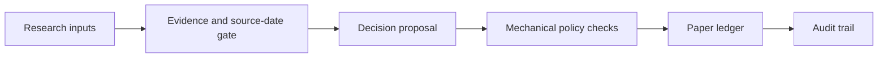

# Market Decision Ledger

> A paper-only, auditable reference implementation for market-research governance and deterministic portfolio accounting.

Market Decision Ledger is not a trading bot. It has no brokerage integration, no market-data API, no performance claim, and no real-money execution path.

It demonstrates a systems-design approach: separate untrusted research from policy gates, deterministic state transitions, decision audits, and human review.

## What it demonstrates



The public implementation enforces:

- A synthetic-symbol allow-list.
- Minimum confidence, maximum position count, and maximum position-value rules.
- Positive deposits, prices, and quantities.
- One paper deposit per date.
- Complete price snapshots before a valuation mark.
- Local-only state with no brokerage or network dependency.

## Quick start

All committed examples are synthetic.

```bash
python3 scripts/portfolio.py --state-dir /tmp/mdl-demo init --cash 1000

python3 scripts/portfolio.py --state-dir /tmp/mdl-demo buy ACME 250 \
  --price 50 --confidence 8 --reason "Synthetic example only"

python3 scripts/portfolio.py --state-dir /tmp/mdl-demo mark \
  --prices '{"ACME": 52}' --benchmark-close 100
```

The `--state-dir` keeps any runtime output outside committed fixtures. Use `runtime/` for a local experiment; it is ignored by Git.

## Verify

```bash
bash scripts/check-public-safety.sh
python3 -m unittest discover -s tests -v
```

The test suite covers duplicate deposits, allow-list and confidence gates, position caps, invalid sales, complete price snapshots, and an end-to-end synthetic paper flow. GitHub Actions runs the same checks.

## Documentation

| Document | Purpose |
|---|---|
| [Architecture](docs/architecture.md) | What is mechanically enforced versus policy-level or human-review work. |
| [Governance model](docs/governance.md) | The role separation, evidence gates, and HOLD-default protocol. |
| [Limitations](docs/limitations.md) | What the project does not claim or model. |
| [Synthetic examples](examples/README.md) | Safe fixtures and an illustrative decision-audit record. |
| [Development and authorship](docs/ai-collaboration.md) | Clear disclosure of project ownership and AI assistance. |
| [Security and privacy](SECURITY.md) | Rules that keep credentials and personal data out of the public repository. |

## Design principle: HOLD is a valid outcome

The system favors a documented **HOLD** when evidence is missing, stale, contradictory, or below the configured confidence threshold. This is more useful than forcing a transaction merely because a workflow ran.

## My role and AI assistance

I defined the paper-only boundary, governance model, role separation, evidence requirements, audit format, and safety constraints; I then reviewed and validated the implementation against those requirements. OpenAI Codex assisted with implementation, testing, documentation, and iteration.

This repository distinguishes deterministic code from procedural policy controls and does not present AI-assisted code as solely hand-written. See [Development and authorship](docs/ai-collaboration.md).

## Important disclaimer

Educational systems-design prototype only. It does not provide investment advice, screen securities, certify Sharia compliance, connect to brokers, execute trades, or promise returns.

## License

Released under the [MIT License](LICENSE).
