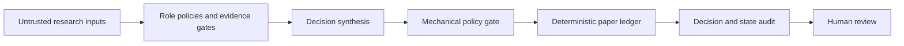

# Architecture

Market Decision Ledger is a **paper-only reference implementation** for documenting how research, policy constraints, deterministic accounting, and audit records can fit together.



## What is enforced in code

The public ledger intentionally focuses on deterministic rules that can be tested:

- An explicit allow-list of synthetic symbols.
- A minimum confidence threshold.
- Maximum position count and position-size cap.
- Positive amounts, prices, and quantities.
- One dated deposit per day.
- Complete price snapshots before recording a mark.
- No brokerage, market-data, or network integration.

## What remains a policy or human-review concern

The repository does **not** claim to automate investment suitability, source truth, Sharia certification, or real-world execution. Those are governance and review concerns that require current evidence and qualified judgment.

## State design

Runtime state is kept outside committed examples:

```text
runtime/
  state.json     current paper cash and positions
  events.csv     append-only event log by application convention
  history.csv    aggregate valuation history
```

State-changing commands use a local recovery journal. The journal is written before the event and state files; if either write is interrupted, the next ledger command replays the same event ID once and reconciles `events.csv` with `state.json` before continuing. This small reference implementation assumes a single writer and does not claim tamper evidence, immutable storage, or database-grade concurrent transactions.

The committed `examples/` directory contains only fictional fixtures and documentation.
